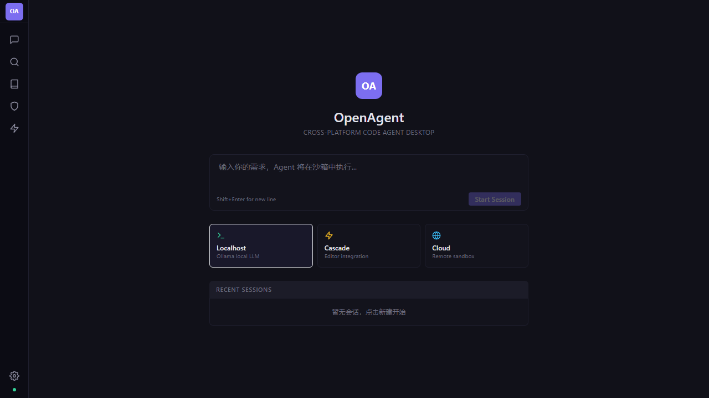
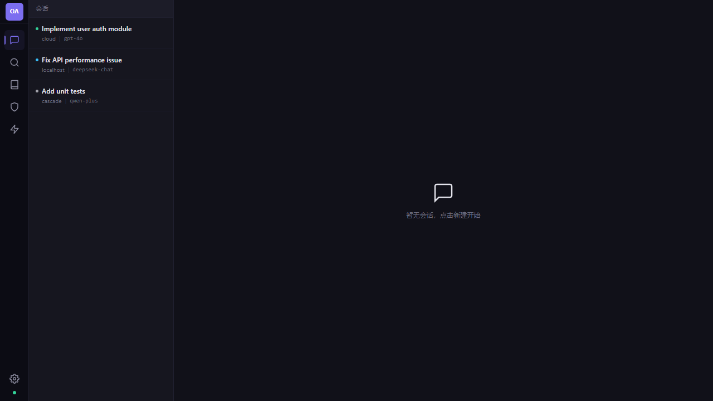
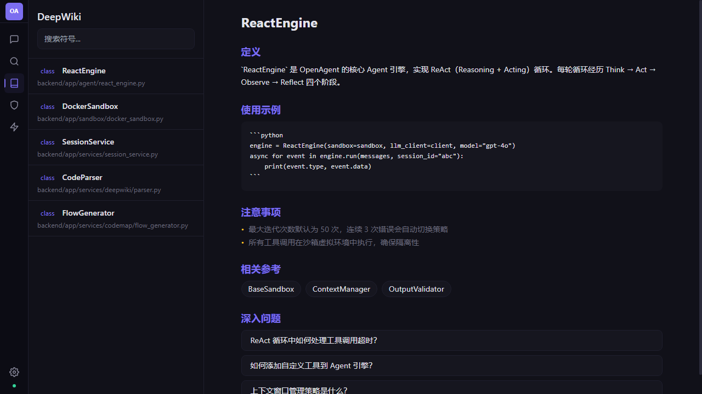
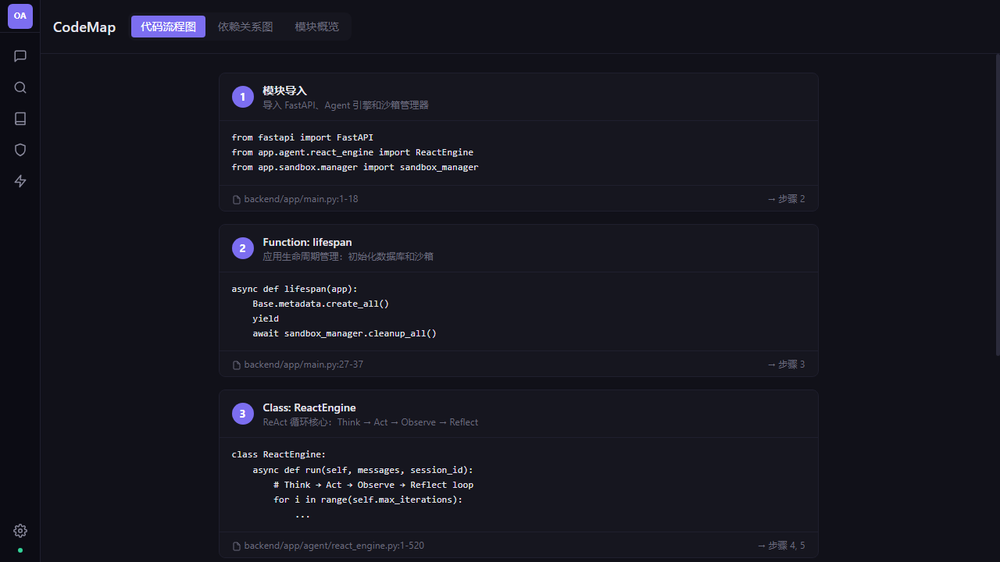
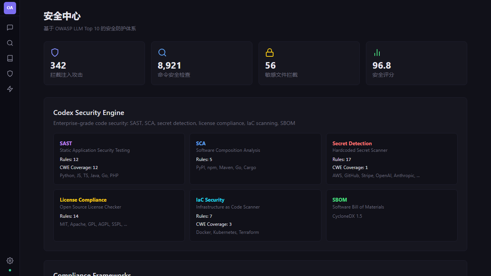
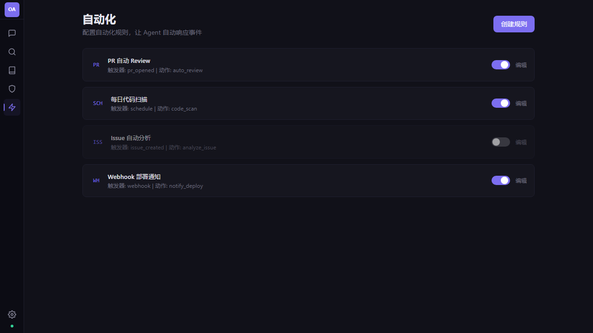
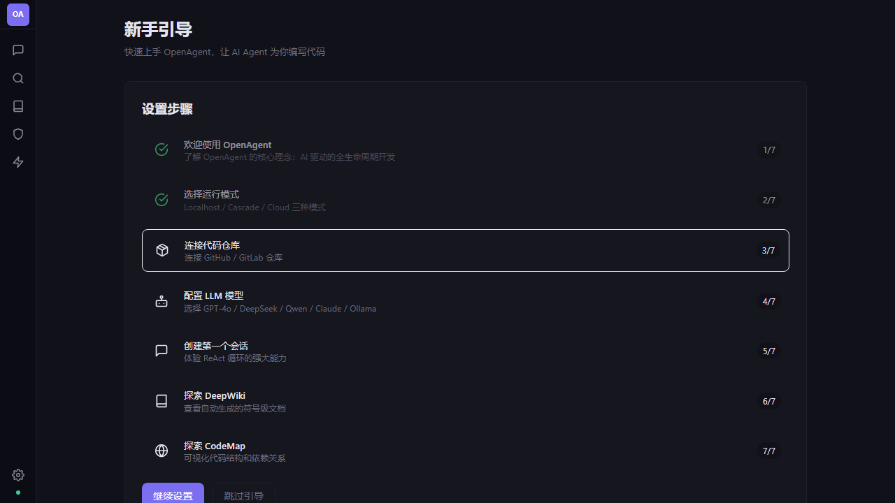
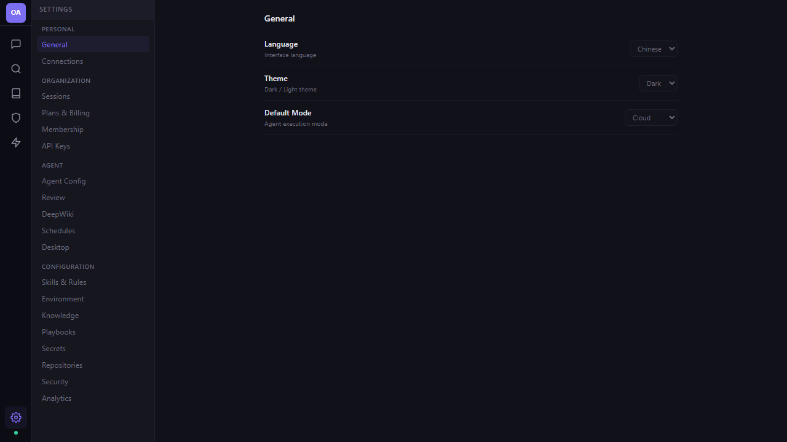

# OpenAgent — AI 驱动的全生命周期软件开发平台

[English](#english) | [中文](#中文)

## 中文

### 概述

OpenAgent 是一个 AI 驱动的虚拟化软件开发平台，支持从规划、编码、测试、调试到部署的全生命周期管理。
系统核心是**零幻觉开发**：通过真实环境执行 + 精准代码索引 + 实时验证反馈的闭环实现。

```
┌─────────────────────────────────────────────────────────────────────────┐
│                          OpenAgent 架构                                │
│                                                                         │
│  ┌──────────┐    ┌──────────┐    ┌──────────┐    ┌──────────────────┐  │
│  │ Web App  │    │ Desktop  │    │   CLI    │    │  Agent Protocol  │  │
│  │ (Next.js)│    │ (Tauri)  │    │ (Python) │    │ (MCP/A2A/AG-UI) │  │
│  └─────┬────┘    └────┬─────┘    └────┬─────┘    └────────┬─────────┘  │
│        └──────────────┼───────────────┼───────────────────┘            │
│                       ▼                                                 │
│  ┌─────────────────────────────────────────────────────────────────┐   │
│  │              FastAPI Backend (REST + WebSocket + SSE)            │   │
│  │                                                                   │   │
│  │  ┌────────────┐  ┌────────────┐  ┌────────────┐  ┌──────────┐  │   │
│  │  │ Agent 引擎 │  │ 沙箱虚拟化 │  │ 代码智能   │  │ 平台服务 │  │   │
│  │  │            │  │            │  │            │  │          │  │   │
│  │  │ ReAct循环  │  │ Docker容器 │  │ DeepWiki   │  │ 认证授权 │  │   │
│  │  │ 任务规划   │  │ 文件系统   │  │ CodeMap    │  │ 计费管理 │  │   │
│  │  │ 自我修复   │  │ 终端流     │  │ 语义搜索   │  │ 审计日志 │  │   │
│  │  │ 模型路由   │  │ 桌面流     │  │ 交叉引用   │  │ MCP市场  │  │   │
│  │  │ 上下文管理 │  │ 快照恢复   │  │ 代码度量   │  │ 自动化   │  │   │
│  │  └────────────┘  └────────────┘  └────────────┘  └──────────┘  │   │
│  └─────────────────────────────────────────────────────────────────┘   │
│                       │                                                 │
│                       ▼                                                 │
│  ┌──────────────────────────────────────────────────────────────────┐  │
│  │  数据层: PostgreSQL + SQLite + Vector DB (Embedding)             │  │
│  └──────────────────────────────────────────────────────────────────┘  │
└─────────────────────────────────────────────────────────────────────────┘
```

### 核心特性

- **Agent 驱动开发** — 非传统 IDE 模式，Agent 主动规划并执行，用户通过对话监督审批
- **三种运行模式** — Localhost（本地）/ Cascade（编辑器内）/ Cloud（云端虚拟机）
- **零幻觉引擎** — 7 层能力栈：沙箱隔离 → 工具调用 → 上下文工程 → 代码精准索引 → 实时执行 → 端到端验证 → 人类审批
- **DeepWiki** — 仓库级自动文档生成，符号级定义/用法/注释/相关引用/深入问题
- **CodeMap** — 代码结构可视化：流程图 + 依赖关系图 + 调用图 + 代码度量
- **OWASP 安全防护** — 基于 OWASP LLM Top 10 (2025) 的全面安全检查
- **行业标准兼容** — JSON-RPC 2.0 / MCP / A2A / AG-UI / OpenAPI / OAuth 2.0 / AGENTS.md / llms.txt
- **多模型支持** — GPT-4o / DeepSeek / Qwen / Claude / Ollama，智能路由自动选择
- **中英双语** — 默认中文界面，支持英文切换（next-intl）
- **沙箱隔离** — 每个 Session 独立 Docker 容器，安全隔离
- **跨端支持** — Web + Desktop (Tauri) + CLI

### 界面截图

#### 主页 — 三模式选择 & 会话启动



#### 会话管理 — 多会话状态追踪



#### DeepWiki — 符号级代码文档



#### CodeMap — 代码结构可视化



#### 安全中心 — Codex Security Engine & OWASP LLM Top 10



#### 自动化 — Agent 自动响应规则



#### 新手引导 — 7 步交互式教程



#### 设置 — 统一配置中心 (18 个分类)



### 技术栈

| 层 | 技术 |
|---|---|
| 前端 | Next.js 14, React 18, TypeScript, Tailwind CSS, next-intl |
| 后端 | FastAPI, Python 3.12, SQLAlchemy, PostgreSQL 16 |
| Agent 引擎 | ReAct 循环, Tree-sitter AST, Token 预算管理, 多模型智能路由 |
| 代码智能 | DeepWiki (符号文档), CodeMap (结构可视化), 语义搜索 (Embedding) |
| 虚拟环境 | Docker (Phase 1), KVM/QEMU (Phase 2) |
| 通信 | JSON-RPC 2.0, SSE, WebSocket |
| 协议 | MCP (工具连接), AG-UI (事件流), A2A (Agent协作), AGENTS.md |
| 安全 | OWASP LLM Top 10, JWT + RBAC, 危险命令拦截, 敏感文件保护 |
| 跨端 | Tauri 2.x (桌面), CLI (命令行) |

### 下载安装

从 [GitHub Releases](https://github.com/gaosichun888/openagent/releases) 下载对应平台安装包：

| 平台 | 安装包 | 说明 |
|------|--------|------|
| Windows | `OpenAgent_0.1.0_x64-setup.exe` | Windows 10/11 (64-bit) |
| macOS | `OpenAgent_0.1.0_x64.dmg` | macOS 12+ (Intel / Apple Silicon) |
| Linux (Deb) | `openagent_0.1.0_amd64.deb` | Ubuntu 22.04+ / Debian 12+ |
| Linux (AppImage) | `OpenAgent_0.1.0_amd64.AppImage` | 通用 Linux |

### 快速开始

#### Docker Compose（推荐）

```bash
git clone https://github.com/gaosichun888/openagent.git
cd openagent
cp .env.example .env  # 编辑 .env 填入 LLM API Key
docker-compose up -d
```

访问 http://localhost:3000

#### 手动启动

```bash
# 后端
cd backend
pip install -r requirements.txt
uvicorn app.main:app --reload --port 8000

# 前端
cd frontend
npm install
npm run dev
```

#### Desktop 客户端（Tauri）

```bash
cd desktop
npm install
npm run tauri dev    # 开发模式
npm run tauri build  # 构建安装包
```

### 项目结构

```
openagent/
├── backend/                    # FastAPI 后端
│   ├── app/
│   │   ├── api/                # REST API 路由 (35 个模块)
│   │   │   ├── sessions.py     # 会话 CRUD + SSE 流
│   │   │   ├── agents.py       # Agent 信息 + 沙箱管理
│   │   │   ├── tools.py        # 工具注册 + 执行
│   │   │   ├── deepwiki.py     # DeepWiki 索引/搜索/文档
│   │   │   ├── codemaps.py     # CodeMap 分析/依赖/流程
│   │   │   ├── auth.py         # JWT 认证
│   │   │   ├── knowledge.py    # 知识库管理
│   │   │   ├── playbooks.py    # 任务模板
│   │   │   ├── secrets.py      # 密钥管理
│   │   │   ├── blueprints.py   # 环境蓝图
│   │   │   ├── repos.py        # 仓库管理
│   │   │   ├── onboarding.py   # 新手引导
│   │   │   ├── security.py     # OWASP 安全扫描
│   │   │   ├── discovery.py    # llms.txt / agents.txt
│   │   │   ├── billing.py      # 计费管理
│   │   │   ├── batch.py        # 批量会话
│   │   │   ├── cicd.py         # CI/CD 集成
│   │   │   ├── audit.py        # 审计日志
│   │   │   └── ...             # 更多模块
│   │   ├── agent/              # Agent 引擎
│   │   │   ├── react_engine.py # ReAct 循环核心
│   │   │   ├── context_manager.py # 128K Token 预算管理
│   │   │   ├── self_healing.py # 自我修复引擎
│   │   │   ├── model_router.py # 多模型智能路由
│   │   │   ├── task_planner.py # 任务分解引擎
│   │   │   ├── planner.py      # 规划器
│   │   │   ├── validators.py   # 输出验证 + 危险命令检测
│   │   │   └── tools/          # 5 个内置工具
│   │   │       ├── shell_exec.py
│   │   │       ├── file_ops.py
│   │   │       ├── git_ops.py
│   │   │       ├── search_code.py
│   │   │       └── base.py
│   │   ├── sandbox/            # 沙箱虚拟化层
│   │   │   ├── base.py         # 抽象基类 (14 个方法)
│   │   │   ├── docker_sandbox.py  # Docker 容器沙箱
│   │   │   ├── local_sandbox.py   # 本地进程沙箱
│   │   │   └── manager.py     # 沙箱管理器 (生命周期)
│   │   ├── services/           # 业务服务层 (25+ 服务)
│   │   │   ├── deepwiki/       # DeepWiki 引擎
│   │   │   ├── codemap/        # CodeMap 引擎
│   │   │   ├── knowledge/      # 知识库管理
│   │   │   ├── playbook/       # 任务模板
│   │   │   ├── llm_service.py  # 多模型 LLM 路由
│   │   │   ├── session_service.py # 会话服务
│   │   │   ├── git_service.py  # Git 集成
│   │   │   ├── security_service.py # OWASP 安全检查
│   │   │   ├── onboarding_service.py # 新手引导
│   │   │   ├── memory_service.py # 三级记忆体系
│   │   │   ├── billing_service.py # ACU 计费
│   │   │   ├── event_sourcing.py # 事件溯源
│   │   │   └── ...
│   │   ├── protocols/          # 协议层
│   │   │   ├── jsonrpc.py      # JSON-RPC 2.0
│   │   │   ├── mcp.py          # MCP Client/Server
│   │   │   ├── a2a.py          # A2A Agent 协作
│   │   │   └── agui.py         # AG-UI 16 种事件
│   │   ├── models/             # 数据模型
│   │   ├── schemas/            # Pydantic schemas
│   │   ├── core/               # 核心配置 (Auth/RBAC/Telemetry)
│   │   └── main.py             # 应用入口
│   ├── tests/                  # 103 个测试
│   ├── Dockerfile
│   └── requirements.txt
├── frontend/                   # Next.js 前端
│   ├── src/
│   │   ├── app/                # 30 个页面
│   │   │   ├── sessions/       # 会话管理 + 详情 (6 标签页)
│   │   │   ├── deepwiki/       # DeepWiki
│   │   │   ├── codemaps/       # CodeMap
│   │   │   ├── knowledge/      # 知识库
│   │   │   ├── playbooks/      # 任务模板
│   │   │   ├── security/       # 安全中心
│   │   │   ├── onboarding/     # 新手引导
│   │   │   ├── analytics/      # 分析仪表盘
│   │   │   ├── settings/       # 设置 (6 Tab)
│   │   │   └── ...             # 更多页面
│   │   ├── components/         # React 组件
│   │   │   ├── session/        # Chat/Worklog/Terminal/Editor/Changes/Desktop
│   │   │   ├── layout/         # Sidebar 等布局
│   │   │   ├── deepwiki/       # DeepWiki 组件
│   │   │   └── codemap/        # CodeMap 组件
│   │   ├── lib/                # API 客户端 / 工具库
│   │   └── messages/           # i18n 翻译 (zh/en, 280+ keys)
│   ├── Dockerfile
│   └── package.json
├── cli/                        # CLI 工具 (init/start/session/handoff)
├── desktop/                    # Tauri 桌面客户端 (Windows/macOS/Linux)
├── docs/                       # 文档和截图
├── docker-compose.yml          # 服务编排
├── Makefile                    # 常用命令
├── AGENTS.md                   # Agent 配置规范
├── CONTRIBUTING.md             # 贡献指南
├── .env.example                # 环境变量模板
└── .github/workflows/ci.yml   # GitHub Actions CI
```

### API 概览 (220+ 路由)

#### 核心 API

| 接口 | 方法 | 说明 |
|------|------|------|
| `/api/sessions` | GET/POST | 会话列表/创建 |
| `/api/sessions/{id}` | GET/DELETE | 会话详情/删除 |
| `/api/sessions/{id}/chat` | POST | 发送消息 + SSE 事件流 |
| `/api/sessions/{id}/messages` | GET | 消息历史 |
| `/api/sessions/{id}/events` | GET | 事件历史 (Worklog) |
| `/ws/terminal/{id}` | WebSocket | 实时终端 |
| `/ws/events/{id}` | WebSocket | 实时事件流 |

#### 代码智能

| 接口 | 方法 | 说明 |
|------|------|------|
| `/api/deepwiki/index` | POST | 索引仓库 |
| `/api/deepwiki/symbols/{name}` | GET | 符号文档 |
| `/api/deepwiki/search` | POST | 语义搜索 |
| `/api/codemaps/analyze` | POST | 模块分析 |
| `/api/codemaps/dependencies` | POST | 依赖图 |
| `/api/codemaps/flow` | POST | 代码流程图 |
| `/api/codemaps/call-graph` | POST | 调用图 |
| `/api/codemaps/metrics` | POST | 代码度量 |

#### 平台服务

| 接口 | 方法 | 说明 |
|------|------|------|
| `/api/auth/login` | POST | JWT 登录 |
| `/api/auth/register` | POST | 用户注册 |
| `/api/knowledge` | GET/POST | 知识库 CRUD |
| `/api/playbooks` | GET/POST | 任务模板 |
| `/api/secrets` | GET/POST | 密钥管理 |
| `/api/blueprints` | GET/POST | 环境蓝图 |
| `/api/repos` | GET/POST | 仓库管理 |
| `/api/mcp/marketplace` | GET | MCP 工具市场 |
| `/api/billing` | GET | 计费管理 |
| `/api/batch` | POST | 批量会话 |
| `/api/cicd` | GET/POST | CI/CD 流水线 |
| `/api/audit` | GET | 审计日志 |
| `/api/onboarding/*` | GET/POST | 新手引导 |
| `/api/security/*` | POST | OWASP 安全扫描 |

#### Agent 发现协议

| 接口 | 说明 |
|------|------|
| `/llms.txt` | LLM 能力声明 |
| `/agents.txt` | Agent 发现协议 |
| `/.well-known/agent.json` | A2A Agent Card |
| `/mcp/rpc` | MCP JSON-RPC 端点 |
| `/a2a/` | A2A 协议端点 |

### 路线图

- [x] **Phase 1 MVP** — Agent 引擎 + Docker 沙箱 + DeepWiki + CodeMap + 前端 UI + 协议栈
  - [x] ReAct 循环引擎 + 5 个内置工具
  - [x] Docker 容器沙箱 (三模式)
  - [x] DeepWiki 符号级文档 + 交叉引用
  - [x] CodeMap 依赖图 + 调用图 + 代码度量
  - [x] 30 个前端页面 + 中英双语 i18n
  - [x] JWT 认证 + RBAC 权限
  - [x] MCP + A2A + AG-UI + JSON-RPC 2.0
  - [x] 事件溯源 + 会话回放
  - [x] OWASP LLM Top 10 安全防护
  - [x] 新手引导 + 示例项目 + Prompt 模板
  - [x] CLI 工具 + Tauri 桌面客户端
  - [x] llms.txt / agents.txt 发现协议
  - [x] 计费引擎 (ACU 分档)
  - [x] CI/CD 集成 + 批量会话
  - [x] 103 个自动化测试
- [ ] **Phase 2 智能增强** — KVM 虚拟机 + Windows 支持 + MCP Marketplace 实际安装
- [ ] **Phase 3 企业级** — SSO/SAML + SOC2 合规 + 多集群部署

### 关于

OpenAgent 是一个开源的 AI 驱动软件开发平台，将自主代码智能体能力整合到专业桌面应用中。灵感来源于 Codex、Devin 等行业领先工具，OpenAgent 结合 ReAct 推理引擎与虚拟化沙箱，实现安全、可验证的全生命周期软件开发 —— 从规划、编码到测试、调试和部署。

**核心优势：**
- **虚拟化执行** — 所有 Agent 操作在隔离的 Docker 容器中运行，确保安全性和可复现性
- **零幻觉架构** — 真实环境执行 + 精准代码索引 + 实时验证反馈闭环
- **跨端支持** — 原生桌面应用 (Tauri)、Web 应用 (Next.js)、命令行工具
- **协议优先** — 基于行业标准：MCP 工具连接、AG-UI 事件流、A2A Agent 协作
- **企业级安全** — OWASP LLM Top 10 合规、SAST/SCA 扫描、密钥检测、许可证合规

**作者：** [gaosichun888](https://github.com/gaosichun888)  
**仓库：** [github.com/gaosichun888/openagent](https://github.com/gaosichun888/openagent)

---

<a id="english"></a>
## English

### Overview

OpenAgent is an AI-driven virtualized software development platform supporting full lifecycle management from planning, coding, testing, debugging to deployment. The core is **zero-hallucination development**: achieved through real environment execution + precise code indexing + real-time validation feedback loop.

### Key Features

- **Agent-Driven Development** — Not a traditional IDE; Agent proactively plans and executes while users supervise via dialogue
- **Three Running Modes** — Localhost / Cascade (in-editor) / Cloud (remote VM)
- **Zero-Hallucination Engine** — 7-layer capability stack ensures every line of code is verified in real environment
- **DeepWiki** — Repository-level auto documentation with symbol-level definitions/usage/notes/references/follow-ups
- **CodeMap** — Code structure visualization with flow diagrams + dependency graphs + call graphs + code metrics
- **OWASP Security** — OWASP LLM Top 10 (2025) based security protection
- **Industry Standards** — JSON-RPC 2.0 / MCP / A2A / AG-UI / OpenAPI / OAuth 2.0 / AGENTS.md / llms.txt
- **Multi-Model Support** — GPT-4o / DeepSeek / Qwen / Claude / Ollama with intelligent routing
- **Bilingual** — Chinese default with English support (next-intl)
- **Sandbox Isolation** — Each session runs in its own Docker container
- **Cross-Platform** — Web + Desktop (Tauri) + CLI

### Download

Download platform-specific installers from [GitHub Releases](https://github.com/gaosichun888/openagent/releases):

| Platform | Package | Requirements |
|----------|---------|-------------|
| Windows | `OpenAgent_0.1.0_x64-setup.exe` | Windows 10/11 (64-bit) |
| macOS | `OpenAgent_0.1.0_x64.dmg` | macOS 12+ |
| Linux (Deb) | `openagent_0.1.0_amd64.deb` | Ubuntu 22.04+ / Debian 12+ |
| Linux (AppImage) | `OpenAgent_0.1.0_amd64.AppImage` | Universal Linux |

### Quick Start

```bash
git clone https://github.com/gaosichun888/openagent.git
cd openagent
cp .env.example .env  # Edit .env to add your LLM API key
docker-compose up -d
```

Visit http://localhost:3000

### Stats

| Metric | Value |
|--------|-------|
| Source Files | 230+ |
| Lines of Code | ~28,000 |
| API Routes | 220+ |
| Frontend Pages | 30 |
| Automated Tests | 153 |
| Agent Intelligence Modules | 7 |
| i18n Keys | 280+ |

### About

OpenAgent is an open-source, AI-driven software development platform that brings autonomous code agent capabilities to a professional desktop application. Inspired by industry-leading tools like Codex and Devin, OpenAgent combines a ReAct-based agent engine with virtualized sandboxing to enable safe, verifiable, full-lifecycle software development — from planning and coding to testing, debugging, and deployment.

**Key Differentiators:**
- **Virtualized Execution** — All agent operations run inside isolated Docker containers, ensuring safety and reproducibility
- **Zero-Hallucination Architecture** — Real environment execution + precise code indexing + real-time verification feedback loop
- **Cross-Platform** — Native desktop app (Tauri), web app (Next.js), and CLI interface
- **Protocol-First** — Built on industry standards: MCP for tool connectivity, AG-UI for event streaming, A2A for agent collaboration
- **Enterprise Security** — OWASP LLM Top 10 compliance, SAST/SCA scanning, secret detection, license compliance

**Author:** [gaosichun888](https://github.com/gaosichun888)  
**Repository:** [github.com/gaosichun888/openagent](https://github.com/gaosichun888/openagent)

### License

MIT
