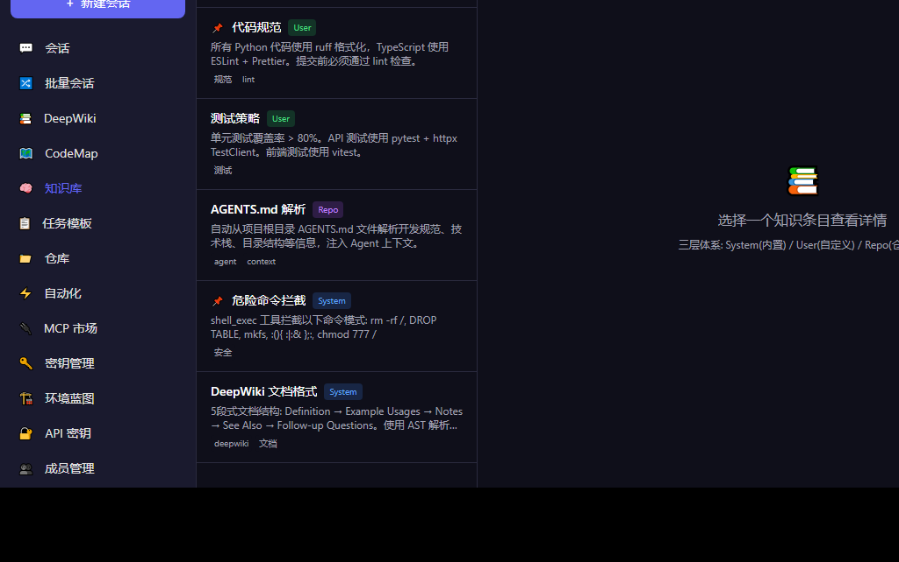
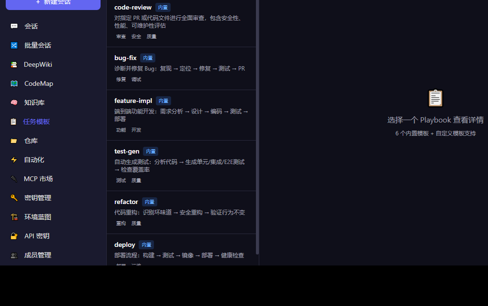
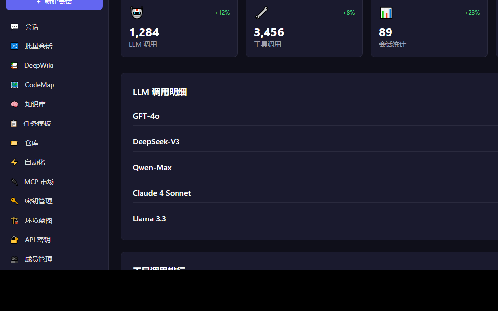
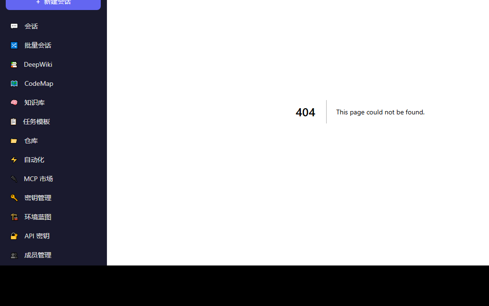
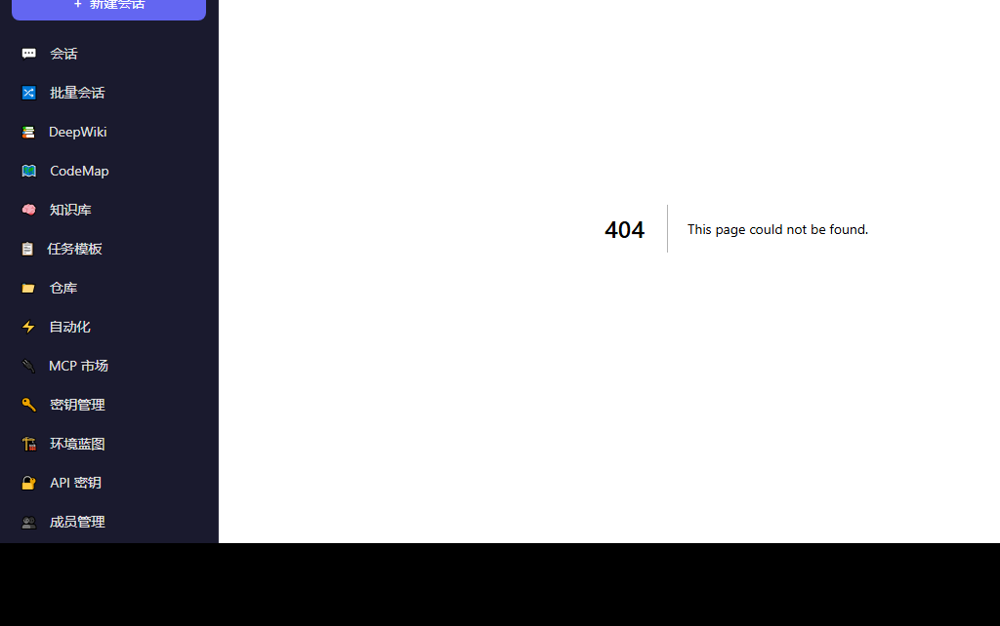
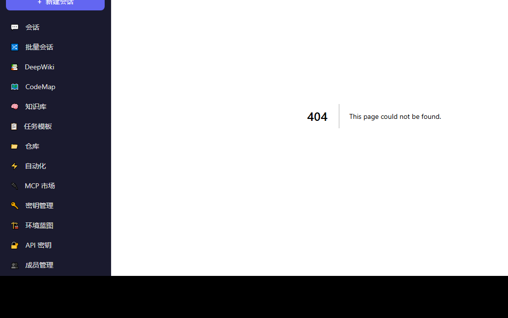

# OpenAgent — AI 驱动的全生命周期软件开发平台

[English](#english) | [中文](#中文)

## 中文

### 概述

OpenAgent 是一个 AI 驱动的虚拟化软件开发平台，支持从规划、编码、测试、调试到部署的全生命周期管理。
系统核心是**零幻觉开发**：通过真实环境执行 + 精准代码索引 + 实时验证反馈的闭环实现。

```
┌─────────────────────────────────────────────────────────────┐
│                       OpenAgent 架构                         │
│                                                              │
│  用户 ──→ 对话面板 ──→ Session API ──→ Agent引擎(ReAct)      │
│                                          │                    │
│                                   Think → Act → Observe       │
│                                          │                    │
│                                    ┌─────┴─────┐             │
│                                    │  沙箱虚拟环境  │             │
│                                    │ (Docker/KVM) │             │
│                                    └───────────┘             │
│                                          │                    │
│              ┌──────────┬──────────┬─────┴────┐              │
│              │          │          │          │              │
│           Shell      File       Git      Search            │
│           执行       读写       操作       搜索              │
│                                                              │
│  监控: Worklog(时间线) + Terminal(终端) + Desktop(桌面)       │
└─────────────────────────────────────────────────────────────┘
```

### 核心特性

- **Agent 驱动开发** — 非传统 IDE 模式，Agent 主动规划并执行，用户通过对话监督审批
- **三种运行模式** — Localhost（本地）/ Cascade（编辑器内）/ Cloud（云端虚拟机）
- **零幻觉引擎** — 7 层能力栈保障每行代码都经过真实验证
- **DeepWiki** — 仓库级自动文档生成，符号级定义/用法/注释/相关引用/深入问题
- **CodeMap** — 代码结构可视化，流程图 + 依赖关系图 + 模块概览
- **行业标准兼容** — JSON-RPC 2.0 / MCP / A2A / AG-UI / OpenAPI / OAuth 2.0 / AGENTS.md
- **多模型支持** — GPT-4o / DeepSeek / Qwen / Claude / Ollama，智能路由自动选择
- **中英双语** — 默认中文界面，支持英文切换（next-intl）
- **沙箱隔离** — 每个 Session 独立 Docker 容器，安全隔离

### 界面截图

#### 主页 — 三模式选择 & 会话管理


#### DeepWiki — 符号级代码文档


#### CodeMap — 代码结构可视化


#### 知识库 — 三层知识体系 (System / User / Repo)



#### 任务模板 (Playbooks)



#### 分析面板



#### CI/CD 流水线



#### 调度管理



#### 环境快照



#### 设置


### 技术栈

| 层 | 技术 |
|---|---|
| 前端 | Next.js 14, React 18, TypeScript, Tailwind CSS, next-intl |
| 后端 | FastAPI, Python 3.12, SQLAlchemy, PostgreSQL 16 |
| Agent 引擎 | ReAct 循环, Tree-sitter AST, Token 预算管理 |
| 代码智能 | DeepWiki (符号文档), CodeMap (结构可视化) |
| 虚拟环境 | Docker (Phase 1), KVM/QEMU (Phase 2) |
| 通信 | JSON-RPC 2.0, SSE, WebSocket |
| 协议 | MCP (工具连接), AG-UI (事件流), A2A (Agent协作) |

### 快速开始

#### Docker Compose（推荐）

```bash
git clone https://github.com/gaosichun888/openagent.git
cd openagent
cp .env.example .env  # 编辑 .env 填入 LLM API Key
docker-compose up -d
```

访问 http://localhost:3000

#### 手动启动

```bash
# 后端
cd backend
pip install -r requirements.txt
uvicorn app.main:app --reload --port 8000

# 前端
cd frontend
npm install
npm run dev
```

### 项目结构

```
openagent/
├── backend/                    # FastAPI 后端
│   ├── app/
│   │   ├── api/                # REST API 路由
│   │   │   ├── sessions.py     # 会话 CRUD + SSE 流
│   │   │   ├── agents.py       # Agent 信息 + 沙箱管理
│   │   │   ├── tools.py        # 工具注册 + 执行
│   │   │   ├── deepwiki.py     # DeepWiki 索引/搜索/文档
│   │   │   └── codemaps.py     # CodeMap 分析/依赖/流程
│   │   ├── agent/              # Agent 引擎
│   │   │   ├── react_engine.py # ReAct 循环核心
│   │   │   ├── context.py      # 上下文管理 (128K预算)
│   │   │   ├── planner.py      # 任务规划器
│   │   │   ├── validators.py   # 输出验证 (危险命令检测)
│   │   │   └── tools/          # 5个内置工具
│   │   ├── sandbox/            # 沙箱虚拟化层
│   │   │   ├── base.py         # 抽象基类 (14个方法)
│   │   │   ├── docker_sandbox.py  # Docker 容器沙箱
│   │   │   ├── local_sandbox.py   # 本地进程沙箱
│   │   │   └── manager.py     # 沙箱管理器 (生命周期)
│   │   ├── services/           # 业务服务
│   │   │   ├── deepwiki/       # DeepWiki 引擎
│   │   │   │   ├── parser.py           # AST 解析器
│   │   │   │   ├── symbol_extractor.py # 符号提取器
│   │   │   │   ├── doc_generator.py    # 5段式文档生成
│   │   │   │   ├── embedding_service.py# 向量嵌入
│   │   │   │   └── indexer.py          # 仓库索引器
│   │   │   ├── codemap/        # CodeMap 引擎
│   │   │   │   ├── analyzer.py         # 代码分析器
│   │   │   │   ├── dependency_graph.py # 依赖关系图
│   │   │   │   └── flow_generator.py   # 流程图生成器
│   │   │   ├── llm_service.py  # 多模型 LLM 路由
│   │   │   ├── session_service.py # 会话服务
│   │   │   └── tool_service.py # 工具服务
│   │   ├── protocols/          # 协议层
│   │   │   ├── jsonrpc.py      # JSON-RPC 2.0
│   │   │   ├── mcp.py          # MCP Client/Server
│   │   │   └── agui.py         # AG-UI 事件标准
│   │   ├── models/             # 数据模型
│   │   ├── schemas/            # Pydantic schemas
│   │   ├── core/               # 核心配置
│   │   └── main.py             # 应用入口
│   ├── Dockerfile
│   └── requirements.txt
├── frontend/                   # Next.js 前端
│   ├── src/
│   │   ├── app/                # App Router 页面
│   │   │   ├── sessions/       # 会话管理
│   │   │   ├── deepwiki/       # DeepWiki 页面
│   │   │   ├── codemaps/       # CodeMap 页面
│   │   │   └── settings/       # 设置页面
│   │   ├── components/         # React 组件
│   │   │   ├── session/        # Chat/Worklog/Terminal
│   │   │   ├── layout/         # Sidebar 等布局
│   │   │   ├── deepwiki/       # DeepWiki 组件
│   │   │   └── codemap/        # CodeMap 组件
│   │   ├── lib/                # API客户端/工具库
│   │   └── messages/           # i18n 翻译 (zh/en)
│   ├── Dockerfile
│   └── package.json
├── docker-compose.yml          # 服务编排
├── Makefile                    # 常用命令
├── AGENTS.md                   # Agent 配置
├── .env.example                # 环境变量模板
└── .github/workflows/ci.yml   # GitHub Actions CI
```

### API 概览

| 接口 | 方法 | 说明 |
|------|------|------|
| `/api/sessions` | GET/POST | 会话列表/创建 |
| `/api/sessions/{id}` | GET/DELETE | 会话详情/删除 |
| `/api/sessions/{id}/chat` | POST | 发送消息 + SSE 事件流 |
| `/api/sessions/{id}/messages` | GET | 消息历史 |
| `/api/sessions/{id}/events` | GET | 事件历史 (Worklog) |
| `/ws/terminal/{id}` | WebSocket | 实时终端 |
| `/ws/events/{id}` | WebSocket | 实时事件流 |
| `/api/deepwiki/index` | POST | 索引仓库 |
| `/api/deepwiki/symbols/{name}` | GET | 符号文档 |
| `/api/deepwiki/search` | POST | 语义搜索 |
| `/api/codemaps/analyze` | POST | 模块分析 |
| `/api/codemaps/dependencies` | POST | 依赖图 |
| `/api/codemaps/flow` | POST | 代码流程图 |
| `/api/agents` | GET | Agent 信息 |
| `/api/tools` | GET/POST | 工具列表/执行 |

### 路线图

- [x] **Phase 1 MVP** — Agent引擎 + Docker沙箱 + DeepWiki + CodeMap + 前端UI
- [ ] **Phase 2 智能** — KVM虚拟机 + Windows支持 + MCP Marketplace + A2A协议
- [ ] **Phase 3 企业** — 自动化 + Analytics + SSO/RBAC + 桌面客户端

---

<a id="english"></a>
## English

### Overview

OpenAgent is an AI-driven virtualized software development platform supporting full lifecycle management from planning, coding, testing, debugging to deployment. The core is **zero-hallucination development**: achieved through real environment execution + precise code indexing + real-time validation feedback loop.

### Key Features

- **Agent-Driven Development** — Not a traditional IDE; Agent proactively plans and executes while users supervise via dialogue
- **Three Running Modes** — Localhost / Cascade (in-editor) / Cloud (remote VM)
- **Zero-Hallucination Engine** — 7-layer capability stack ensures every line of code is verified in real environment
- **DeepWiki** — Repository-level auto documentation with symbol-level definitions/usage/notes/references/follow-ups
- **CodeMap** — Code structure visualization with flow diagrams + dependency graphs + module overview
- **Industry Standards** — JSON-RPC 2.0 / MCP / A2A / AG-UI / OpenAPI / OAuth 2.0 / AGENTS.md
- **Multi-Model Support** — GPT-4o / DeepSeek / Qwen / Claude / Ollama with intelligent routing
- **Bilingual** — Chinese default with English support (next-intl)
- **Sandbox Isolation** — Each session runs in its own Docker container

### Quick Start

```bash
git clone https://github.com/gaosichun888/openagent.git
cd openagent
cp .env.example .env  # Edit .env to add your LLM API key
docker-compose up -d
```

Visit http://localhost:3000

### License

MIT
